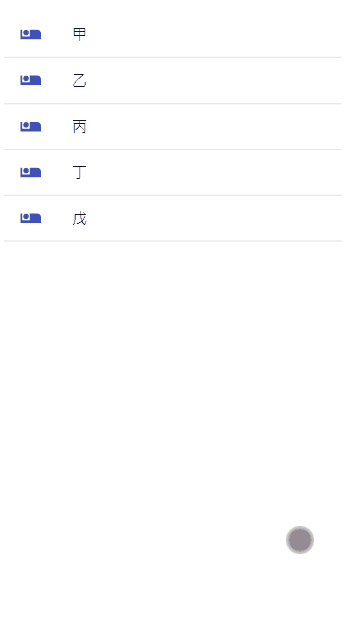

# MERN-project

## 功能

- 點擊 Patient 後顯示 Dialog 呈現 Order(醫囑)
- Dialog 右上按鈕來新增 Order，中間輸入欄與垃圾桶可編輯 or 刪除既有的 Order

## 運行

必須先有 [Node.js](https://nodejs.org/)

Client :

```sh
cd frontend
yarn install
yarn start
```

Server :

```sh
cd backend
yarn install
yarn start
```

## Port

```sh
Client 127.0.0.1:3000
Server 127.0.0.1:8888
```

## API

| 功能                      | 網址                   |
| ------------------------- | ---------------------- |
| 取得所有患者              | GET /api/patients      |
| 取得患者醫囑              | GET /api/orders/:id    |
| 修改患者醫囑              | PUT /api/orders        |
| 刪除患者醫囑              | DELETE /api/orders/:id |
| (測試用) 重新產生測試資料 | GET /api/reset         |
| (測試用) 清空醫囑資料     | DELETE /api/orders     |

## Demo

> 新增醫囑

> 

---

> 修改醫囑



---

> 刪除醫囑


